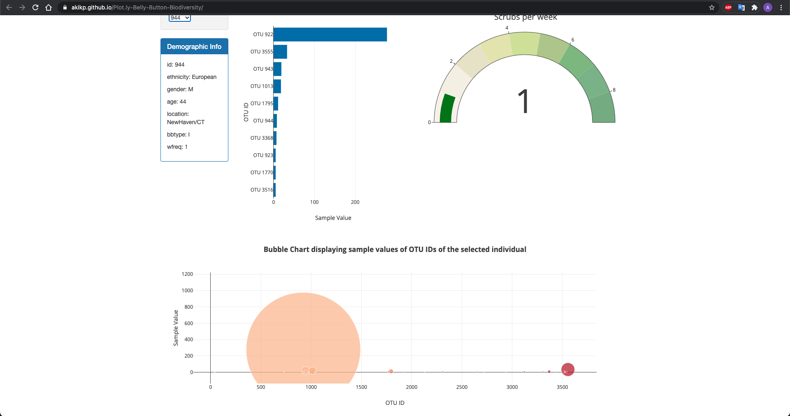

# Plot.ly-Belly-Button-Biodiversity

https://akikp.github.io/Plot.ly-Belly-Button-Biodiversity/

## Task Performed

1. Use the D3 library to read in samples.json.

2. reate a horizontal bar chart with a dropdown menu to display the top 10 OTUs

3. Create a bubble chart that displays each sample.

4. Display the sample metadata, i.e., an individual's demographic information.

5. Create the Gauge Chart to plot the weekly washing frequency of the individual.

6. Update all of the plots any time that a new sample is selected.

7. Create a scrub chart that gets updated whenever a new data is selected (bonus taks - Advanced Challenge Assignment (Optional) )

8. Deploy the app to GitHub Pages.
